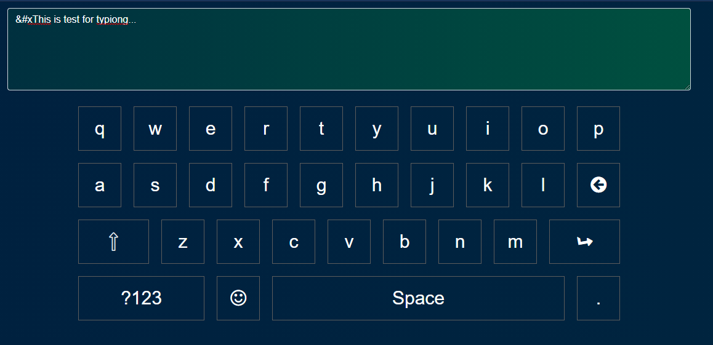

# Magic JavaScript Virtual Keyboard

## About

This web application is a virtual keyboard popularly known as On-Screen Keyboard which is being used in typing to an input. You can enter text, type characters, numbers, letters, and multiple emojis using this script without additional keyboards.

## Installation
However you need have the following requirements to run the script on your machine:
- Code Editor (VS Code, Sublime, NotePad etc.)
- Web Browser (Microsoft Edge, Chrome, FireFox or etc.)

## Features
- GBoard, SwiftKey like virtual keyboard
- Easy to install
- Numpad, Keypad, Char pad featured
- Core JavaScript (ES6+)
- Easy to maintain and manipulate
- Bootstrap 4.x

# ScreenShot

### Conclusion
This package may have issues and bugs. Don't forget to report if an error or problem occurs!

### License
Standard MIT License